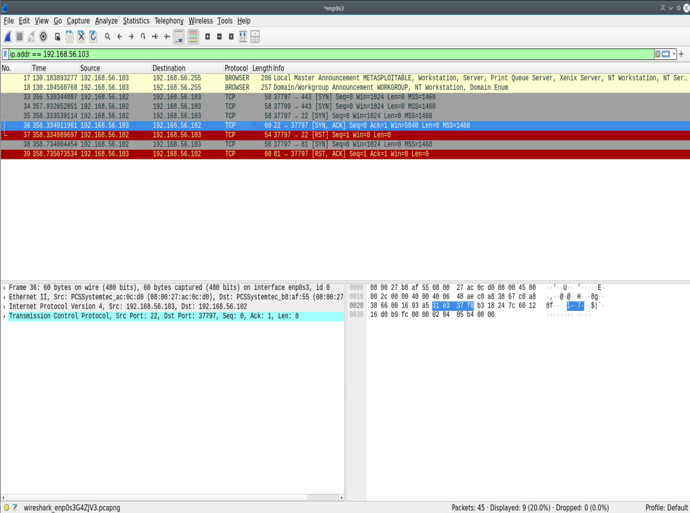
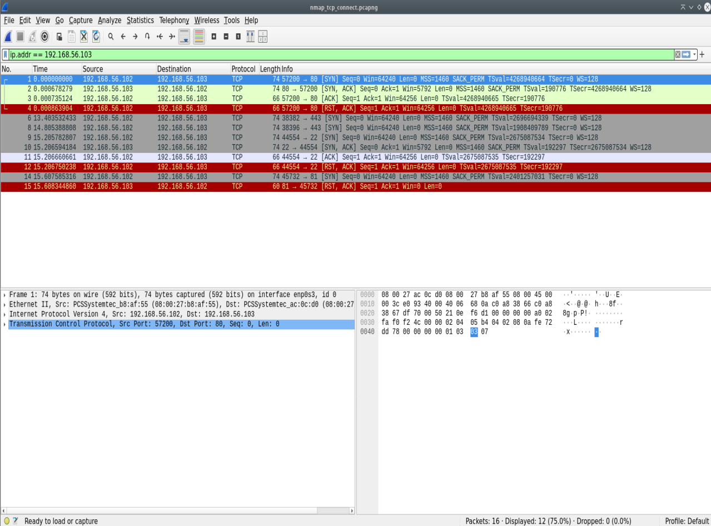
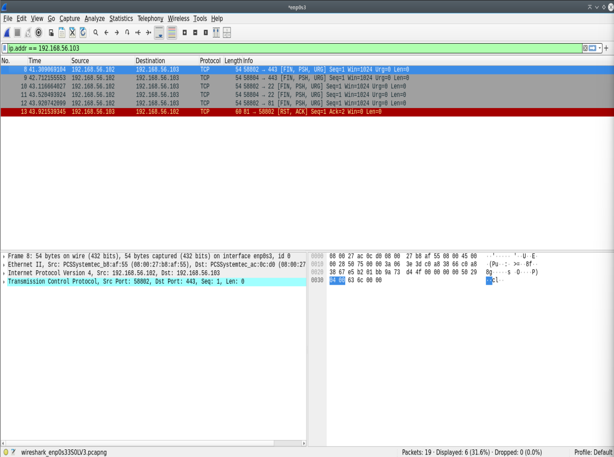
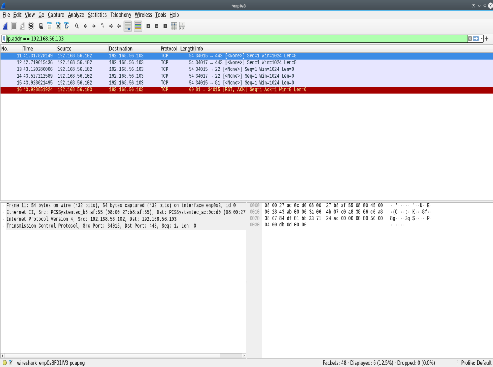
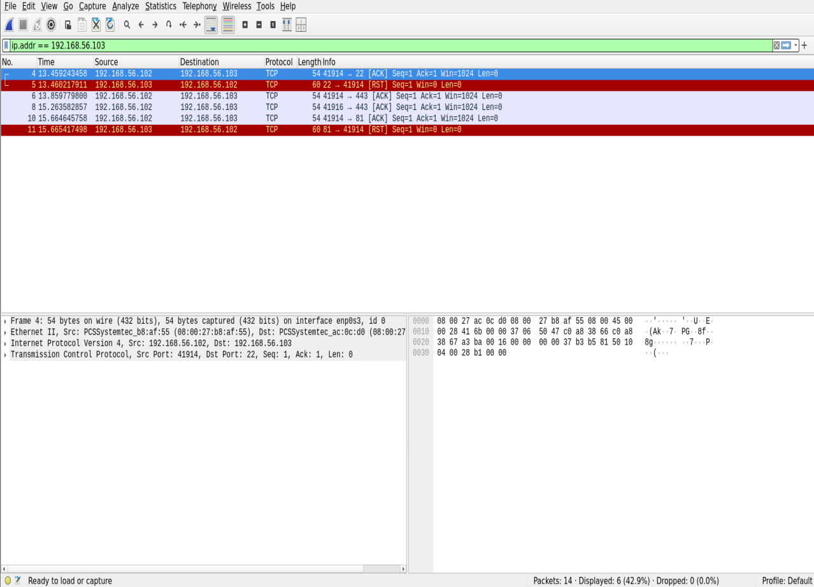

# Lab 02: Nmap Reconnaissance Mechanics & Low-Level Packet Analysis

## Executive Summary
This lab evaluates low-level TCP frame mechanics during network reconnaissance. By capturing and analyzing raw traffic with Wireshark across five distinct Nmap scan types (`-sS`, `-sT`, `-sX`, `-sN`, `-sA`), this project documents RFC 793 protocol compliance, connection overhead, host responses, and firewall detection mechanisms across Open, Closed, and Filtered port states.

---

## Lab Architecture & Testbed
* **Attacker System:** Debian Linux (`192.168.56.102`)
* **Target System:** Metasploitable 2 (`192.168.56.103`)
* **Network Segment:** Isolated Host-Only Adapter (`192.168.56.0/24`)
* **Packet Capture Tool:** Wireshark v4.x
* **Target Port Configurations:**
  * **Port 22 (SSH):** OPEN (Active listening service)
  * **Port 81:** CLOSED (No active listening service)
  * **Port 443 (HTTPS):** FILTERED (Silent drop rule applied via `sudo iptables -A INPUT -p tcp --dport 443 -j DROP`)

---

## Scan Technique Breakdown & Packet Dynamics

### 1. TCP SYN Stealth Scan (`-sS`)
* **Command:** `sudo nmap -sS -p 22,81,443 -T2 192.168.56.103`
* **Capture File:** [`captures/nmap_syn_stealth.pcapng`](./captures/nmap_syn_stealth.pcapng)
* **Packet Dynamics:**
  * **Port 22 (Open):** Attacker sends `[SYN]` $\rightarrow$ Target replies `[SYN, ACK]` $\rightarrow$ Attacker immediately sends `[RST]` to tear down the socket before completing the handshake (Half-Open scan).
  * **Port 81 (Closed):** Attacker sends `[SYN]` $\rightarrow$ Target replies `[RST, ACK]` indicating no listening daemon.
  * **Port 443 (Filtered):** Attacker sends `[SYN]` $\rightarrow$ Firewall drops packet; Attacker retransmits `[SYN]` probes until socket timeout.

---

### 2. TCP Connect Scan (`-sT`)
* **Command:** `nmap -sT -p 22,81,443 -T2 192.168.56.103`
* **Capture File:** [`captures/nmap_tcp_connect.pcapng`](./captures/nmap_tcp_connect.pcapng)
* **Packet Dynamics:**
  * **Port 22 (Open):** Completes a full OS-level 3-way handshake (`[SYN]` $\rightarrow$ `[SYN, ACK]` $\rightarrow$ `[ACK]`), followed immediately by an active connection closure (`[RST, ACK]` or `[FIN, ACK]`). Does not require root privileges.
  * **Port 81 (Closed):** Target returns `[RST, ACK]` on initial connection attempt.
  * **Port 443 (Filtered):** Retransmits `[SYN]` until reaching default system socket timeout.

---

### 3. TCP Xmas Scan (`-sX`)
* **Command:** `sudo nmap -sX -p 22,81,443 -T2 192.168.56.103`
* **Capture File:** [`captures/nmap_xmas.pcapng`](./captures/nmap_xmas.pcapng)
* **Packet Dynamics:**
  * **Port 22 (Open):** Attacker sends out-of-band flags (`[FIN, PSH, URG]`). Target adheres to RFC 793 by silently ignoring non-SYN probes on open ports (No response).
  * **Port 81 (Closed):** Target returns `[RST, ACK]`.
  * **Port 443 (Filtered):** Firewall drops incoming probe silently (No response; reported as `open|filtered`).

---

### 4. TCP Null Scan (`-sN`)
* **Command:** `sudo nmap -sN -p 22,81,443 -T2 192.168.56.103`
* **Capture File:** [`captures/nmap_null.pcapng`](./captures/nmap_null.pcapng)
* **Packet Dynamics:**
  * **Port 22 (Open):** Attacker sends TCP frame with zero control flags set (`0x000`). Target silently drops packet per RFC 793 (No response).
  * **Port 81 (Closed):** Target returns `[RST, ACK]`.
  * **Port 443 (Filtered):** Packet dropped by target `iptables` rule (No response; reported as `open|filtered`).

---

### 5. TCP ACK Scan (`-sA`)
* **Command:** `sudo nmap -sA -p 22,81,443 -T2 192.168.56.103`
* **Capture File:** [`captures/nmap_ack.pcapng`](./captures/nmap_ack.pcapng)
* **Packet Dynamics:**
  * **Port 22 & 81 (Unfiltered):** Attacker sends `[ACK]`. Target returns `[RST]` for both ports, confirming packets passed through firewall filters regardless of service state (`unfiltered`).
  * **Port 443 (Filtered):** Attacker sends `[ACK]`. Target firewall drops frame; no response received (`filtered`).

---

## Comparative Flag Response Matrix

| Scan Type | Target State | Sent Control Flags | Expected RFC Response | Observed Wireshark Response |
| :--- | :--- | :--- | :--- | :--- |
| **SYN (`-sS`)** | Open (22) | `SYN` | `SYN, ACK` | `SYN, ACK` $\rightarrow$ Torn down with `RST` |
| **SYN (`-sS`)** | Closed (81) | `SYN` | `RST, ACK` | `RST, ACK` |
| **SYN (`-sS`)** | Filtered (443) | `SYN` | No Response | No Response (Retransmitted `SYN`) |
| **Connect (`-sT`)** | Open (22) | `SYN` | `SYN, ACK` | Full Handshake (`SYN` $\rightarrow$ `SYN, ACK` $\rightarrow$ `ACK`) |
| **Xmas (`-sX`)** | Open (22) | `FIN, PSH, URG` | No Response | No Response |
| **Xmas (`-sX`)** | Closed (81) | `FIN, PSH, URG` | `RST, ACK` | `RST, ACK` |
| **Null (`-sN`)** | Open (22) | None (`0x000`) | No Response | No Response |
| **Null (`-sN`)** | Closed (81) | None (`0x000`) | `RST, ACK` | `RST, ACK` |
| **ACK (`-sA`)** | Unfiltered (22) | `ACK` | `RST` | `RST` (Passes Firewall) |
| **ACK (`-sA`)** | Filtered (443) | `ACK` | No Response | No Response (Blocked by Firewall) |
