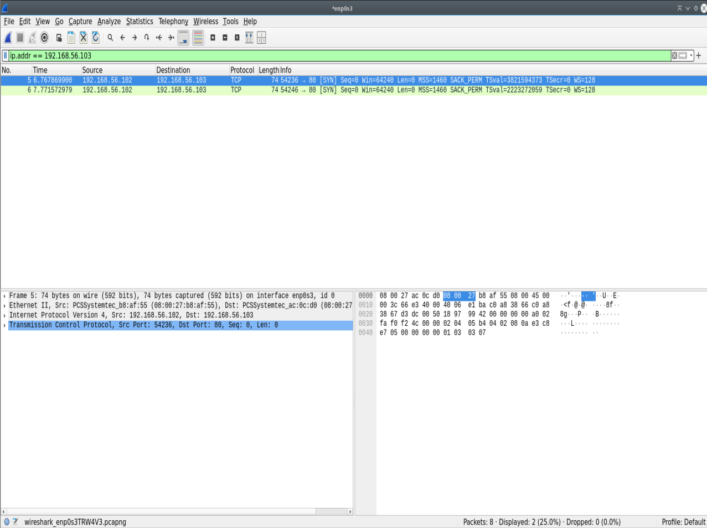
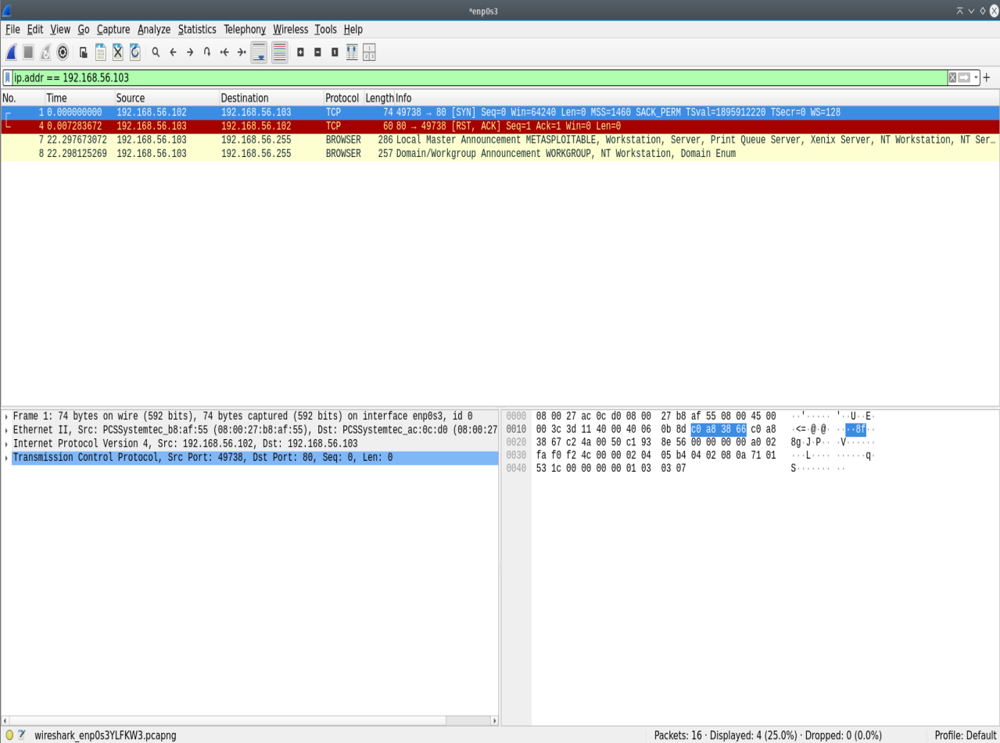
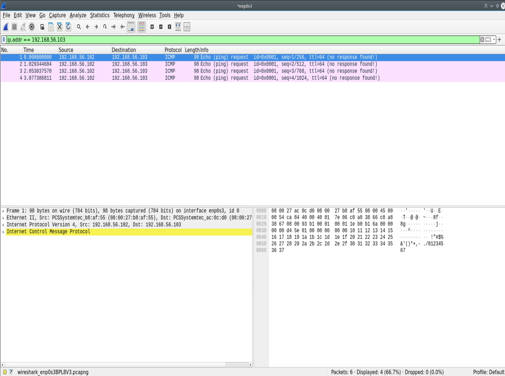
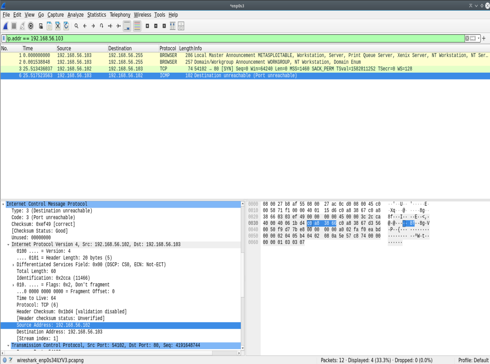
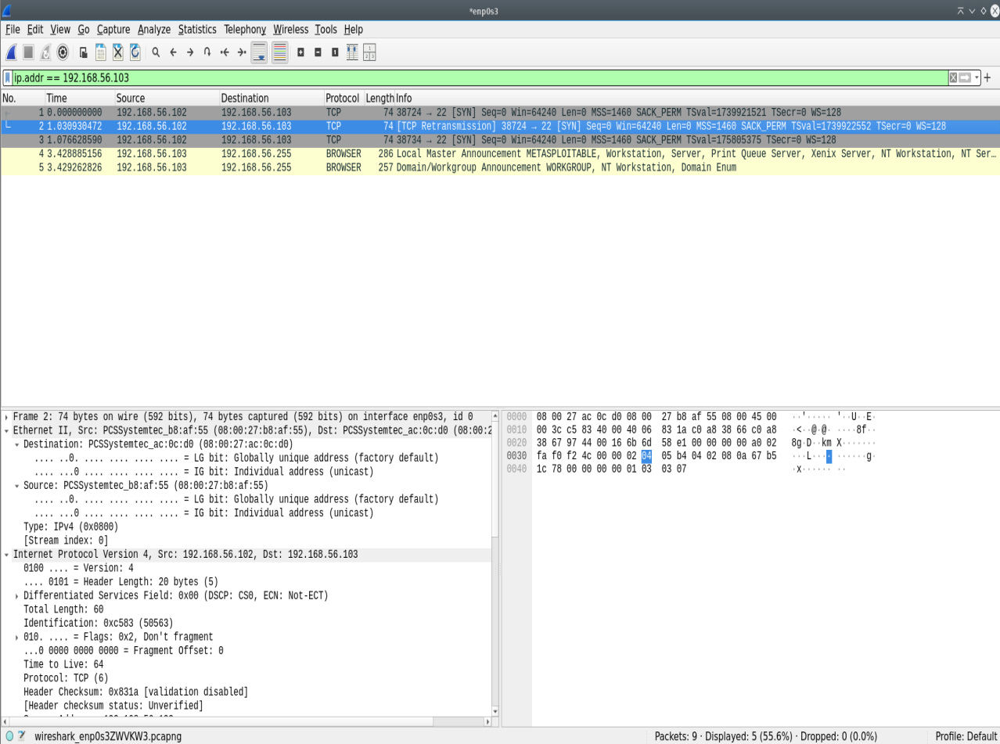

# Lab 03: Host-Based Firewall Filtering Analysis (`iptables` Policy Mechanics)

## Executive Summary
This lab analyzes kernel-level packet filtering mechanics using Linux `iptables` (Netfilter framework). By capturing raw network traffic in Wireshark across five distinct firewall filtering scenarios, this project evaluates TCP connection tear-downs, ICMP error handling, silent drop behavior, and targeted Access Control Lists (ACLs) to document firewall detection and evasion dynamics.

---

## Lab Architecture & Testbed
* **Attacker System:** Debian Linux (`jugaadwned` / `192.168.56.102`)
* **Target System:** Metasploitable 2 (`meta` / `192.168.56.103`)
* **Network Segment:** Isolated Host-Only Virtual Switch (`192.168.56.0/24`)
* **Packet Capture Tool:** Wireshark v4.x
* **Firewall Engine:** Linux Netfilter (`iptables`)

---

## Scenario Analysis & Packet Dynamics

### Scenario 1: Silent TCP Drop (`-j DROP`)
* **Objective:** Evaluate host response when incoming connection requests are silently discarded.
* **Firewall Rule:** `sudo iptables -A INPUT -p tcp -m tcp --dport 80 -j DROP`
* **Capture File:** [`captures/nmap_iptables_drop.pcapng`](./captures/nmap_iptables_drop.pcapng)
* **Packet Dynamics:** The attacker issues `[SYN]` probes targeting TCP port 80. The target firewall silently discards incoming frames. Receiving no response, the attacker host retransmits `[SYN]` packets until timing out, causing Nmap to classify port 80 as `filtered`.

---

### Scenario 2: Active TCP Reset Rejection (`-j REJECT --reject-with tcp-reset`)
* **Objective:** Compare silent drop policies with active socket resets.
* **Firewall Rule:** `sudo iptables -A INPUT -p tcp -m tcp --dport 80 -j REJECT --reject-with tcp-reset`
* **Capture File:** [`captures/nmap_iptables_reject.pcapng`](./captures/nmap_iptables_reject.pcapng)
* **Packet Dynamics:** The attacker transmits a `[SYN]` probe to port 80. The target firewall kernel immediately generates and returns an active `[RST, ACK]` frame in under 1ms. The connection attempt is aborted instantly, causing Nmap to report the port as `closed`.

---

### Scenario 3: ICMP Echo Request Suppression (`-j DROP` ICMP)
* **Objective:** Observe host stealth behavior under ICMP ping diagnostic probes.
* **Firewall Rule:** `sudo iptables -A INPUT -p icmp --icmp-type echo-request -j DROP`
* **Capture File:** [`captures/iptables_icmp_drop.pcapng`](./captures/iptables_icmp_drop.pcapng)
* **Packet Dynamics:** The attacker transmits ICMP `Echo Request` (Type 8) frames. The target drops request packets without returning `Echo Reply` (Type 0) frames, resulting in 100% packet loss and making the target host appear offline to standard ICMP discovery.

---

### Scenario 4: Layer 3 Administrative Rejection (`-j REJECT --reject-with icmp-port-unreachable`)
* **Objective:** Evaluate Layer 3 diagnostic error messaging vs. Layer 4 TCP resets.
* **Firewall Rule:** `sudo iptables -A INPUT -p tcp -m tcp --dport 80 -j REJECT --reject-with icmp-port-unreachable`
* **Capture File:** [`captures/iptables_icmp_reject.pcapng`](./captures/iptables_icmp_reject.pcapng)
* **Packet Dynamics:** Upon receiving a TCP `[SYN]` probe on port 80, the firewall generates an ICMP `Destination Unreachable (Port unreachable)` (Type 3, Code 3) frame back to the source IP. Nmap interprets this administrative notification to mark the target port as `filtered`.

---

### Scenario 5: Targeted Source IP ACL Blacklisting
* **Objective:** Demonstrate granular Access Control List (ACL) filtering based on source IP attributes.
* **Firewall Rule:** `sudo iptables -A INPUT -s 192.168.56.102 -p tcp -m tcp --dport 22 -j DROP`
* **Capture File:** [`captures/iptables_source_drop.pcapng`](./captures/iptables_source_drop.pcapng)
* **Packet Dynamics:** SSH (`[SYN]`) probes originating specifically from `192.168.56.102` are dropped silently, while probes from other source IP addresses on the subnet pass through unfiltered.

---

## Firewall Behavior Comparison Matrix

| Scenario | Target Port / Protocol | Configured Action | Returned Response Frame | Nmap Port State |
| :--- | :--- | :--- | :--- | :--- |
| **1. TCP Drop** | Port 80 (TCP) | `DROP` | *None* (Retransmissions) | `filtered` |
| **2. TCP Reset** | Port 80 (TCP) | `REJECT (tcp-reset)` | `[RST, ACK]` | `closed` |
| **3. ICMP Drop** | Echo Request | `DROP` | *None* (100% Packet Loss) | `Host Down` |
| **4. ICMP Reject** | Port 80 (TCP) | `REJECT (icmp-port-unreachable)` | `ICMP Type 3 Code 3` | `filtered` |
| **5. Source ACL** | Port 22 (TCP) | `DROP (Source: 192.168.56.102)` | *None* | `filtered` |

---

## Artifacts & Evidence
* Capture Logs: [`captures/`](./captures/)
* Visual Evidence: [`screenshots/`](./screenshots/)
