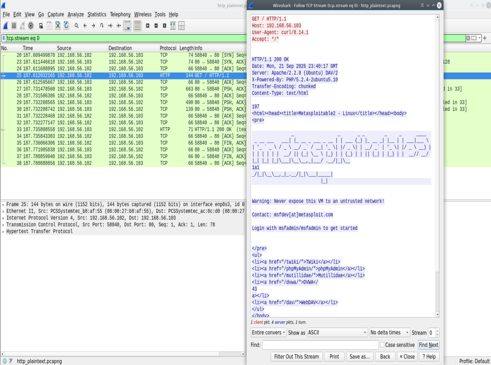
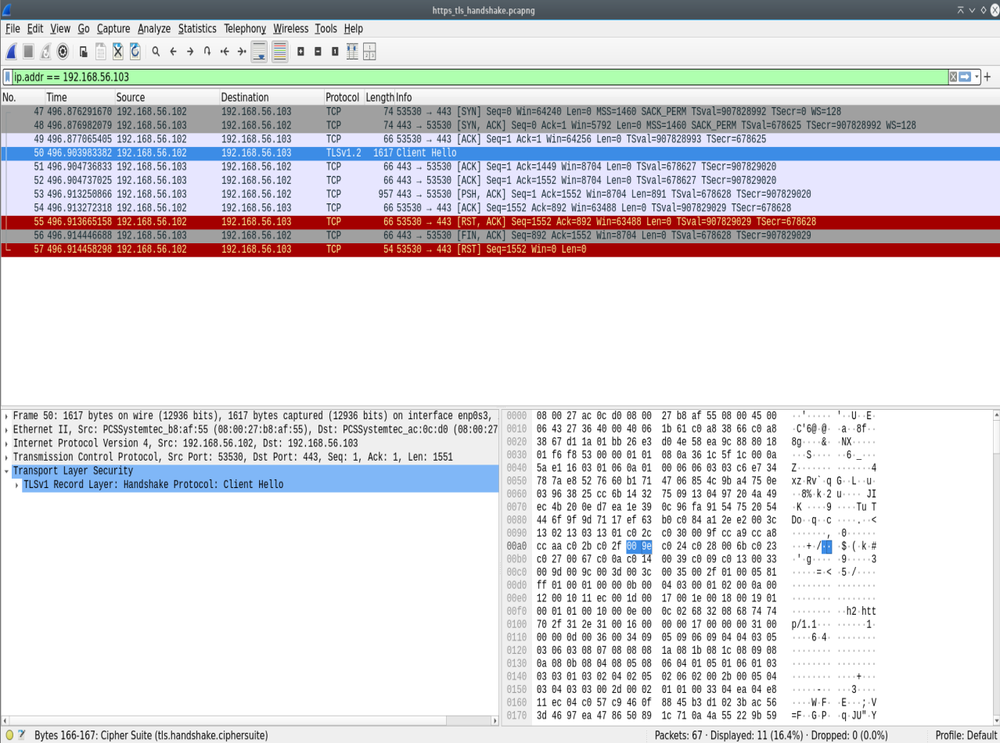

# Lab 04: Encrypted Session & TLS Protocol Mechanics (HTTP vs. HTTPS)

## Executive Summary
This lab evaluates the architectural and security differences between unencrypted Hypertext Transfer Protocol (HTTP) over TCP port 80 and encrypted HTTP Secure (HTTPS) over TCP port 443 using Transport Layer Security (TLS 1.2). By performing deep packet inspection (DPI) in Wireshark, this project demonstrates plain-text payload vulnerability versus cryptographic payload protection, handshake negotiation, and certificate exchange.

---

## Lab Architecture & Testbed
* **Attacker System:** Debian Linux (`192.168.56.102`)
* **Target System:** Metasploitable 2 Web Server (`192.168.56.103`)
* **Network Segment:** Isolated Host-Only Virtual Switch (`192.168.56.0/24`)
* **Analysis Tooling:** Wireshark v4.x, `curl`, Apache Web Server (mod_ssl)

---

## Analysis & Packet Dynamics

### Scenario 1: Plain-Text HTTP Inspection (Port 80)
* **Objective:** Analyze cleartext packet payloads and HTTP protocol headers.
* **Capture File:** [`captures/http_plaintext.pcapng`](./captures/http_plaintext.pcapng)
* **Packet Dynamics:** Following the standard 3-way TCP handshake, the client sends an unencrypted `GET / HTTP/1.1` request. The server responds with `HTTP/1.1 200 OK` containing raw HTML code. 
* **Security Impact:** Any intermediate device across the network path can read sensitive data (cookies, credentials, session tokens) or modify HTTP payloads in transit.

---

### Scenario 2: Encrypted HTTPS & TLS 1.2 Handshake (Port 443)
* **Objective:** Capture and evaluate cryptographic session establishment and application ciphertext.
* **Capture File:** [`captures/https_tls_handshake.pcapng`](./captures/https_tls_handshake.pcapng)
* **Packet Dynamics:**
  1. **TCP Establishment:** Frames 47–49 establish the baseline L4 socket state (`SYN` -> `SYN, ACK` -> `ACK`).
  2. **Client Hello:** Frame 50 transmits supported cipher suites, TLS version (TLS 1.2), and compression methods from client to server.
  3. **Server Hello & Certificate Exchange:** The target host selects the cipher suite, presents its X.509 public key certificate, and agrees on symmetric key parameters.
  4. **Encrypted Application Data:** Subsequent payload frames are encrypted into high-entropy ciphertext, hiding all HTTP request URIs, headers, and body content from passive inspection.

---

## Protocol Security Comparison Matrix

| Feature / Protocol | HTTP (Port 80) | HTTPS (Port 443) |
| :--- | :--- | :--- |
| **Transport Layer Security** | None | TLS 1.2 / TLS 1.3 |
| **Confidentiality** | Plain-Text (Readable) | Encrypted (High-Entropy Ciphertext) |
| **Integrity Protection** | None (Vulnerable to Tampering) | HMAC / Authenticated Encryption (AEAD) |
| **Authentication** | None | Public Key Infrastructure (X.509 Certificates) |
| **Wireshark Stream Inspection** | Full HTTP Headers & Payload Visible | Encrypted Binary Stream |

---

## Artifacts & Evidence
* Capture Logs: [`captures/`](./captures/)
* Visual Evidence: [`screenshots/`](./screenshots/)
