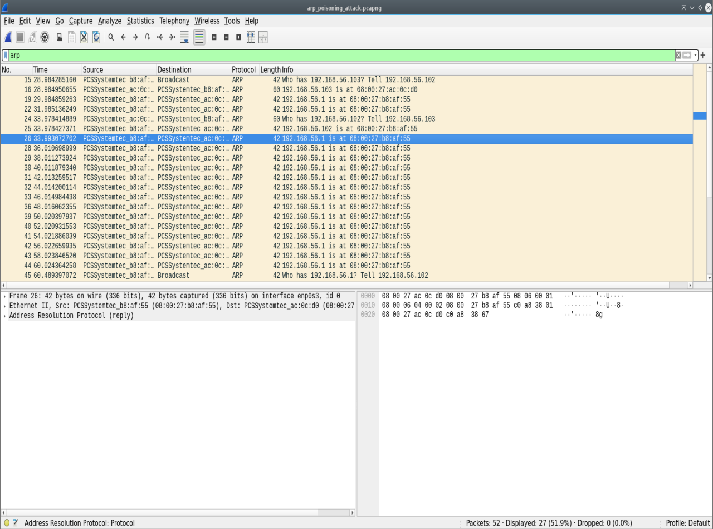
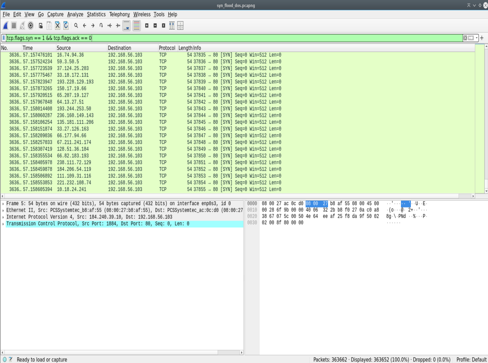

# Lab 05: Network Attack Analysis & Incident Response (ARP Poisoning & TCP SYN Flood)

## Executive Summary
This lab evaluates two fundamental network-layer attack vectors: ARP Cache Poisoning (Layer 2 Man-in-the-Middle) and a TCP SYN Flood (Layer 4 Denial of Service). Using Wireshark for Deep Packet Inspection (DPI), this project documents packet anomalies, Indicators of Compromise (IoCs), and protocol response mechanics required for incident detection and mitigation.

---

## Lab Architecture & Testbed
* **Attacker System:** Debian Linux (`192.168.56.102`)
* **Target System:** Metasploitable 2 (`192.168.56.103`)
* **Network Segment:** Isolated Host-Only Virtual Switch (`192.168.56.0/24`)
* **Analysis & Attack Tooling:** Wireshark v4.x, `arpspoof` (dsniff), `hping3`

---

## Attack Analysis & Packet Dynamics

### Scenario 1: ARP Cache Poisoning (Layer 2 MitM)
* **Objective:** Intercept network communications by overwriting the target's ARP cache.
* **Command Executed:** `sudo arpspoof -i enp0s3 -t 192.168.56.103 192.168.56.1`
* **Capture File:** [`captures/arp_poisoning_attack.pcapng`](./captures/arp_poisoning_attack.pcapng)
* **Packet Dynamics:** The attacker host broadcasts unsolicited ARP `Reply` (Opcode 2) packets associating the MAC address of `192.168.56.102` with the default gateway IP (`192.168.56.1`). Wireshark flags this as a potential ARP spoofing event due to duplicate IP mapping.
* **Incident Detection / IoC:** Rapid succession of unsolicited gratuitous ARP replies and MAC address mapping shifts in host ARP tables (`arp -a`).

---

### Scenario 2: TCP SYN Flood (Layer 4 DoS)
* **Objective:** Exhaust target socket connection state tables using half-open TCP connections.
* **Command Executed:** `sudo hping3 -S -p 80 --flood --rand-source 192.168.56.103`
* **Capture File:** [`captures/syn_flood_dos.pcapng`](./captures/syn_flood_dos.pcapng)
* **Packet Dynamics:** The target receives an abnormally high volume of `TCP SYN` frames on port 80 with spoofed random source IP addresses. The server allocates buffer memory (`SYN_RECV` state) for each connection attempt, transmitting `[SYN, ACK]` frames to non-existent or un-responding sources, exhausting available backlog queues.
* **Incident Detection / IoC:** Extreme spike in TCP SYN packets without subsequent `ACK` completions, paired with high memory utilization in socket backlog tables.

---

## Incident Response & Mitigation Summary

| Attack Vector | Layer | Target Vulnerability | Mitigation Strategy |
| :--- | :--- | :--- | :--- |
| **ARP Poisoning** | Layer 2 (Data Link) | Lack of authentication in dynamic ARP resolutions | Dynamic ARP Inspection (DAI), Static ARP entries, 802.1X Port Security |
| **TCP SYN Flood** | Layer 4 (Transport) | Finite socket backlog queues (`SYN_RECV`) | SYN Cookies (`tcp_syncookies`), Rate Limiting, Firewalls / Scrubbing Centers |

---

## Artifacts & Evidence
* Capture Logs: [`captures/`](./captures/)
* Visual Evidence: [`screenshots/`](./screenshots/)
